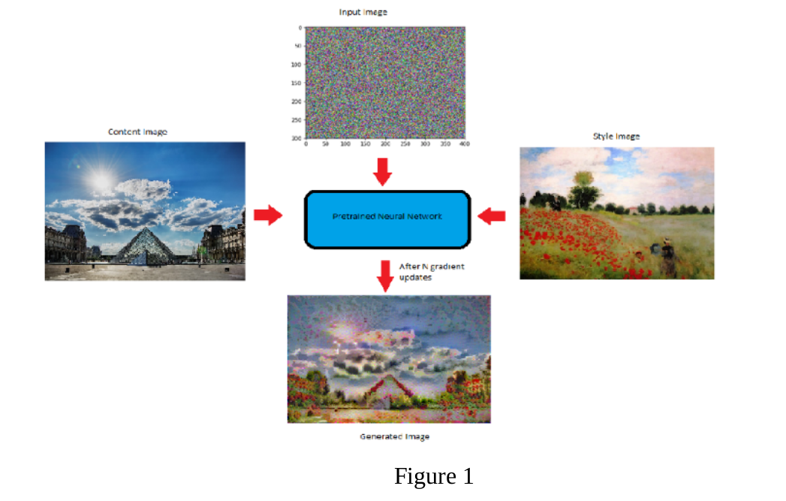
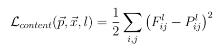
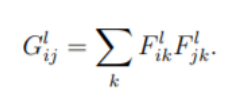
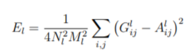
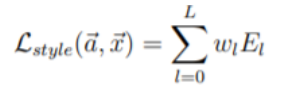
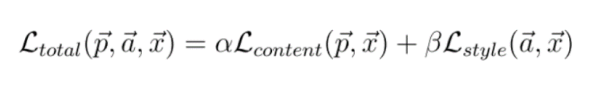
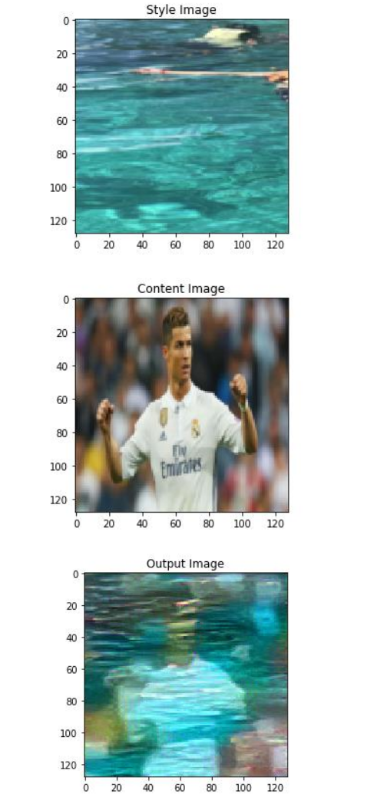
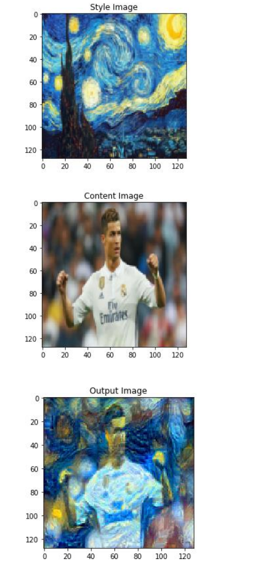

# NeuralStyleTransfer

## Digital Image Processing
The field of digital image processing refers to processing digital images by means of a digital
computer. There is no general agreement among authors regarding where image processing
stops and other related areas, such as image analysis and computer vision, start. Sometimes a
distinction is made by defining image processing as a discipline in which both the input and
output of a process are images. Deep learning methods use data to train neural network
algorithms to do a variety of machine learning tasks. Convolutional neural networks in specific
are deep learning algorithms that are particularly powerful for analysis of images.

Neural style transfer is an optimization technique used to take three images, a content image,
a style reference image (such as an artwork by a famous painter), and the input image you want
to style — and blend them together such that the input image is transformed to look like the
content image, but “painted” in the style of the style image.
The principle of neural style transfer is to define two distance functions, one that describes how
different the content of two images are, Lcontent, and one that describes the difference between
the two images in terms of their style, Lstyle. Then, given three images, a desired style image,
a desired content image, and the input image (initialized with the content image), we try to
transform the input image to minimize the content distance with the content image and its style
distance with the style image.
In Neural Style Transfer we have two images- style and content. We need to copy the style from
the style image and apply it to the content image. By, style we basically mean, the patterns, the
brushstrokes, etc.
In summary, we’ll take the base input image, a content image that we want to match, and the
style image that we want to match. We’ll transform the base input image by minimizing the
content and style distances (losses) with backpropagation, creating an image that matches the
content of the content image and the style of the style image.

ConvNets work on the basic principle of convolution. ConvNets develop a hierarchical
representation of features.
This property is the basis of style transfer.While doing style transfer, we are not training a neural network. Rather, what we're doing is — we start from a blank image composed of random pixel
values, and we optimize a cost function by changing the pixel values of the image. In simple
terms, we start with a blank canvas and a cost function. Then we iteratively modify each pixel
so as to minimize our cost function. To put it in another way, while training neural networks we update our weights and biases, but in style transfer, we keep the weights and biases constant, and instead, update our image.
For doing this, it is important that our cost function correctly represents problem.
The cost function has two terms- a style loss term and a content loss term, both of which are
explained below.

### Content Loss

This is based on the intuition that images with similar content will have similar representation
in the higher layers of the network.
P^l is the representation of the original image and F^l is the representation of the generated
image in the feature maps of layer l.

### Style Loss

In order to capture the style of an image we would calculate how “correlated” these filters are to each other meaning how similar are these feature maps.In-order to calculate a correlation
between different filters or channels we calculate the dot-product between the vectors of the
activations of the two filters.The matrix thus obtained is called Gram Matrix.. These feature
correlations are given by the Gram matrix Gl ∈ RNl×Nl , where Gl
ij is the inner product between the vectorised feature map i and j in layer l:

To generate a texture that matches the style of a given image (Fig 1, style reconstructions), we use gradient descent from a white noise image to find another image that matches the style
representation of the original image. This is done by minimising the mean-squared distance
between the entries of the Gram matrix from the original image and the Gram matrix of the
image to be generated. So let ~a and ~x be the original image and the image that is generatedand Al and Gl their respective style representations in layer l. The contribution of that layer to the total loss is then 

and the total loss is:

where wl are weighting factors of the contribution of each layer to the total loss (see below for specific values of wl in our results)

### Total Loss

where alpha and beta are weights for content and style, respectively. They can be tweaked to
alter our final result.
So our total loss function basically represents our problem- we need the content of the final
image to be similar to the content of the content image and the style of the final image should
be similar to the style of the style image.
Now all we have to do is to minimize this loss. We minimize this loss by changing the input to
the network itself. We basically start with a blank grey canvas and start altering the pixel values
so as to minimize the loss. Any optimizer can be used to minimize this loss.

## Results:

